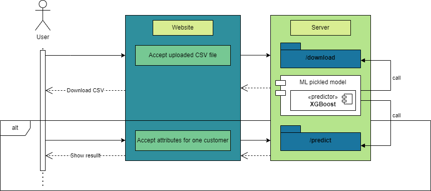
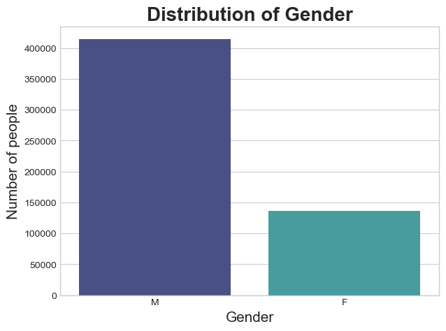
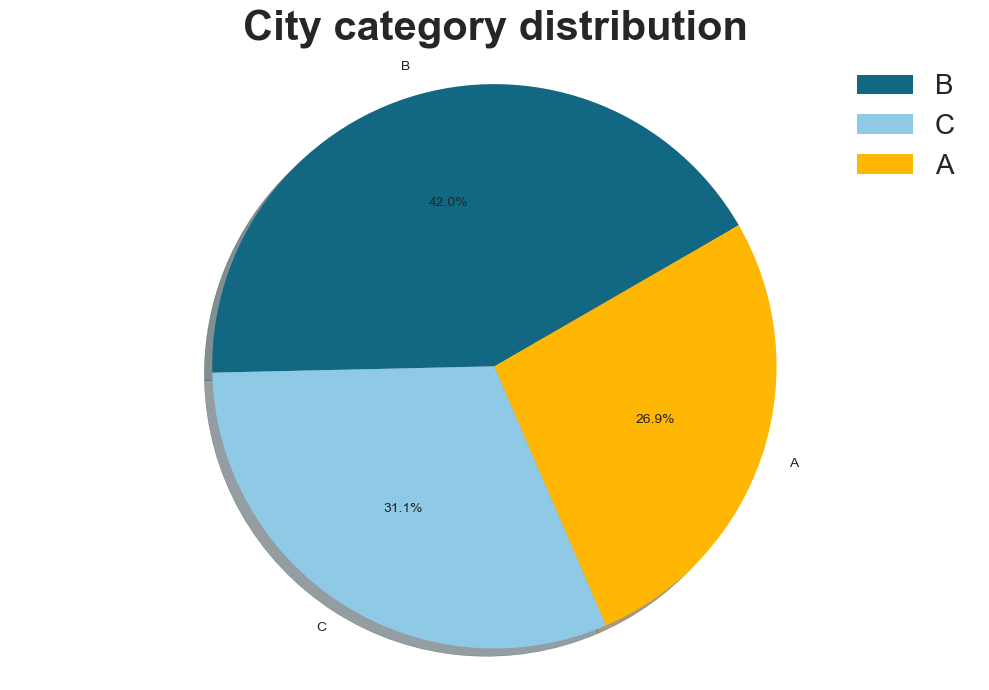
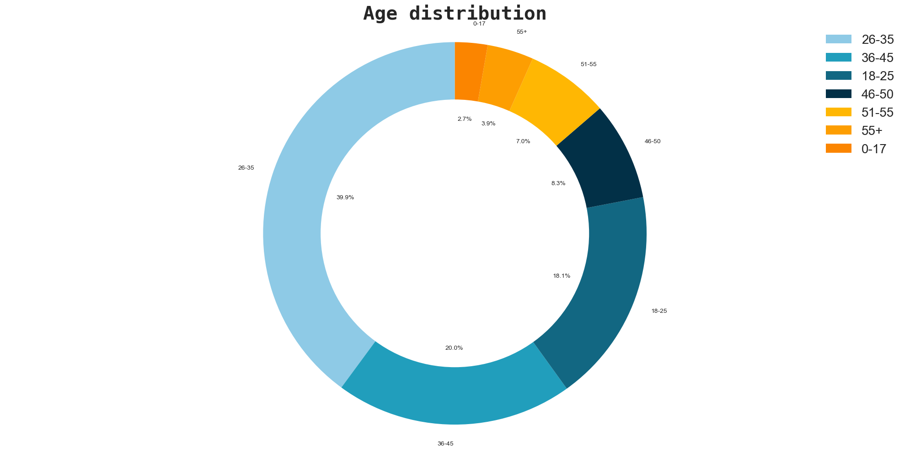
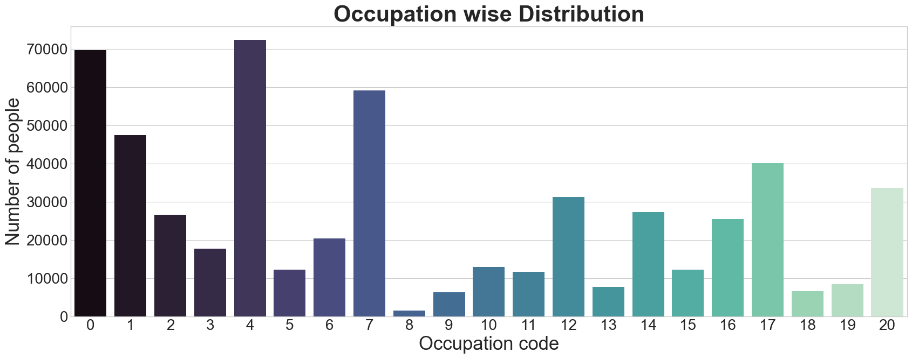
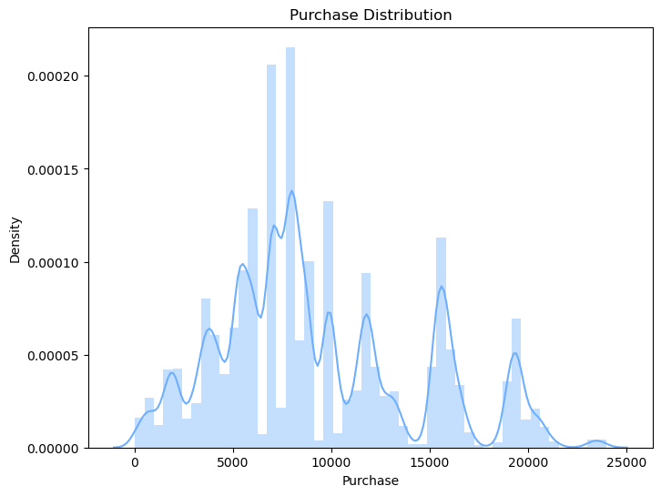

# Consumer-Behaviour-Predictor
<center>


</center>

# Table of contents

- [Consumer-Behaviour-Predictor](#consumer-behaviour-predictor)
  - [Problem Statement](#problem-statement)
  - [Sub-tasks](#sub-tasks)
  - [The Design](#the-design)
  - [Exploratory Data Analysis and Feature Selection](#exploratory-data-analysis-and-feature-selection)
    - [Count Distribution plots](#count-distribution-plots)
    - [Density plot](#density-plot)
  - [Data pre-processing](#data-pre-processing)
    - [Map to ordinal values](#map-to-ordinal-values)
    - [One-hot encoding](#one-hot-encoding)
    - [Mapping v/s One-hot encoding](#mapping-vs-one-hot-encoding)
  - [Models](#models)
    - [XGB Regressor](#xgb-regressor)
    - [Random Forest Regressor](#random-forest-regressor)
  - [Data splitting](#data-splitting)
  - [XGB Regressor tuning](#xgb-regressor-tuning)

## Problem Statement
ABC Private Limited is a retail company seeking to gain insights into their customers' purchase behavior, specifically the purchase amount of various products within different categories. To achieve this, a purchase summary of high volume products for selected customers over the previous month has been provided. The data set comprises of customer demographic information such as age, gender, marital status, city type, and stay-in-current-city, as well as product details including product ID, product category, and the total purchase amount for the previous month. The company aims to build a predictive model that will forecast the purchase amount of customers across various products, enabling them to create personalized offers for customers based on their product preferences.

## Sub-tasks
- Choosing the right parameters that affect the purchase amount and eliminating the unwanted parameters 
- Predicting the amount and increasing the accuracy of the prediction

## The Design


## Exploratory Data Analysis and Feature Selection
Exploratory Data Analysis (EDA) is the process of examining and analyzing data sets in order to summarize their main characteristics, often using statistical graphics and other data visualization techniques.

The goal of EDA is to gain an understanding of the data and identify patterns, relationships, and anomalies that may be present. Here, we use the training data set provided to find the count distribution across various categories. EDA helps us derive insights from the data.

### Count Distribution plots
We have plot pie charts, tree maps, bar-count plots to show the distribution of the data points with regards to age, city, gender, occupation, etc. 







### Density plot
A plot on the density of purchase has been plotted to understand the probability density function of the purchase amount across all data points. It gives a visualization of the amount showing where values cluster most frequently.

The plot displays the distribution of data as a smooth curve that represents the probability density function. The area under the curve represents the total probability of the variable. The density plot is similar to a histogram, but instead of displaying a count of observations within each bin, it shows the probability density of the variable within each bin.



## Data pre-processing
The data must be pre-processed before fed as input for training. Here there are various categorical variables which do not map to numerical value. These must be converted to numerical form. There are two paths that can be deployed:
- Map to ordinal values
- One-hot encoding
### Map to ordinal values
This method revolves around replacing a category to a mapped numeric value. One example is mapping Male to 1 and Female to 0 for the ```Gender``` attribute. 
### One-hot encoding
This involes creating a binary variable for each attribute. Here, we have one-hot encoded ```City_Category```. Each new variable takes on the value 1 if the original variable had that category and 0 otherwise. 

### Mapping v/s One-hot encoding
The main advantage of one-hot encoding is that it preserves the categorical nature of the variable and prevents the numerical values from being interpreted as having an inherent order or magnitude. This is particularly important when dealing with variables that do not have a natural order, such as types of products or regions.

The choice between replacement with values and one-hot encoding depends on the specific problem at hand and the nature of the variable being transformed. If the categories have an inherent order or magnitude, replacement with values may be more appropriate. If the categories are unordered, one-hot encoding is usually the preferred method.

During the analysis process we have found the average purchase amount for the attributes we chose to map and gave an inherent order based off of it.

## Models
### XGB Regressor
- Useful for regression-based problems (continuous output variable
- XGB stands for eXtreme Gradient Boosting Regressor
- Each tree is built sequentially, with each subsequent tree trained to correct the errors made by the previous tree. 
- Several hyperparameters

### Random Forest Regressor
- Like XGB, used for regression-based
- Based on ensemble learning using decision trees
- Each tree is built independently and in parallel.
- Several hyperparameters

## Data splitting 
We split the provided data set in 80:20 for training and testing.
In ML, we split the data to evaluate the performance of our models accurately. The main reason for splitting data into training and testing sets is to train our model on a subset of data and test its performance on unseen data.

By using a separate testing set, we can determine whether our model is overfitting or underfitting. Overfitting occurs when the model performs well on the training data but poorly on the testing data, while underfitting occurs when the model does not capture the underlying patterns in the data and performs poorly on both training and testing data.

Splitting data allows us to optimize our model's parameters on the training data and evaluate its performance on the testing data, which is representative of the real-world data. This process helps us to build models that generalize well to new, unseen data and provide accurate predictions or classifications.

## XGB Regressor tuning
`
xgb = XGBRegressor(colsample_bytree = 0.8, gamma = 0.1, learning_rate = 0.1, max_depth = 11, min_child_weight = 10, verbosity = 0, random_state = 42)`

```colsample_bytree```: It is the subsample ratio of columns when constructing each tree. It specifies the fraction of features to be randomly sampled for each tree.

```gamma```: It controls the minimum loss reduction required to make a further partition on a leaf node of the tree. A higher value of gamma leads to fewer splits.

```learning_rate```: It is the step size shrinkage used in each boosting iteration. A lower learning rate will require more boosting iterations to achieve the same reduction in residual error.

```max_depth```: It is the maximum depth of a tree. A higher value can lead to overfitting, while a lower value can lead to underfitting.

```min_child_weight```: It is the minimum sum of instance weight (hessian) needed in a child. A higher value leads to fewer splits.

```verbosity```: It controls the level of verbosity. 0 indicates silent mode, and 1 indicates printing messages.

```random_state```: It is the random seed used to ensure reproducibility of the model.

There are more parameters but we worked with just these for now as these were the parameters we gained an understanding of.

## Evaluation metrics
- Root Mean Squared Error (RMSE)
- Mean Absolute Percentage Error (MAPE)
- R-squared (R²) or Coefficient of Determination

### Root Mean Squared Error (RMSE)
Root Mean Squared Error (RMSE) is a commonly used metric to evaluate the accuracy of a predictive model. It measures the average squared difference between the predicted and actual values of the target variable. It is calculated as the square root of the average of the squared differences between the predicted and actual values. The RMSE penalizes larger errors more heavily than smaller ones, and a lower value indicates better model performance.

### Mean Absolute Percentage Error (MAPE)
Mean Absolute Percentage Error (MAPE) is another metric used to evaluate the accuracy of a predictive model. It measures the average percentage difference between the predicted and actual values of the target variable. It is calculated as the average of the absolute percentage difference between the predicted and actual values. The MAPE is a relative measure of error, and a lower value indicates better model performance.

### R-squared (R²) or Coefficient of Determination
R-squared (R²) or Coefficient of Determination is a statistical measure that represents the proportion of variance in the target variable that can be explained by the independent variables in a regression model. It ranges from 0 to 1, with 1 indicating that all variance is explained by the model, and 0 indicating that none of the variance is explained. The R-squared value is commonly used to assess the goodness of fit of a regression model, and a higher value indicates a better fit. 

However, it is important to note that a high R-squared does not necessarily mean that the model is a good predictor, as it is possible to have a high R-squared even if the model is overfitting the data. Therefore, it is important to use other metrics and techniques, to evaluate the performance of a model.

## Results
|   | RMSE | MAPE | R2-score |
|---|----------|----------|----------|
| XGB Regressor | 2858.23   | 14%   | 0.69   |
| Random Forest Regressor | 3019.58   | 18%  | 0.64   |

As we can see, XGB performed better and we will proceed with that.

## Pickling and User-Interface
The model is then ```pickled```. Pickling a model refers to the process of serializing a trained machine learning model into a binary format that can be stored as a file on a disk. This file can later be loaded and the model can be used for making predictions without the need to train it again. After pickling, we deployed it on the website so that the user can have an easy to use interface to get the predictions.

## Future Scope
- Tune the parameters further to obtain better results
- Try a different model - neural network models
- Dynamic visualisation and interactive charts
